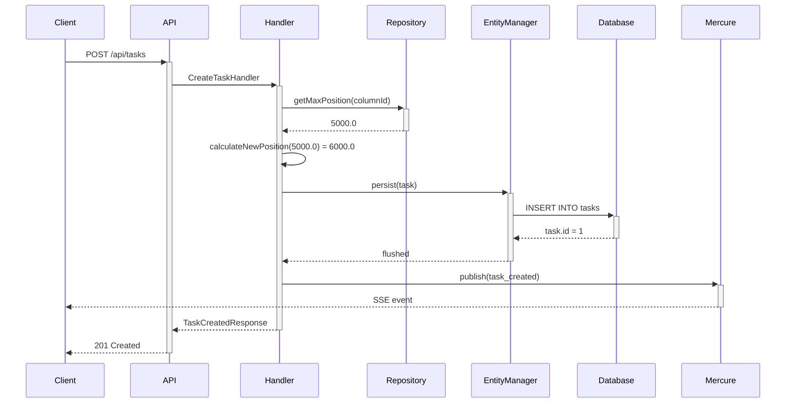
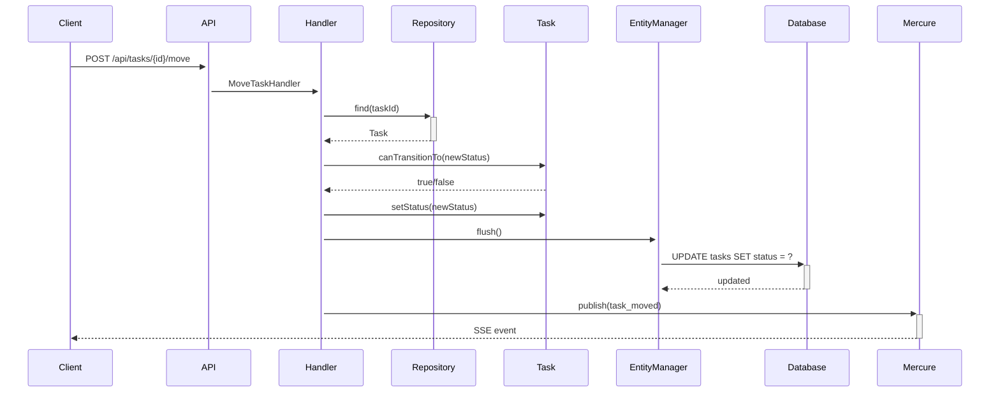

# Kanban Board - Detailed Implementation Guide

## Task Lifecycle

### Creating a Task



### Moving a Task



## Drag & Drop Implementation

### Fractional Indexing

Instead of integer positions (1, 2, 3), we use fractional indexing:

```
Task A: position = 1000.0000000000
Task B: position = 2000.0000000000
Task C: position = 3000.0000000000
```

When inserting Task X between Task A and Task B:

```
Task A: position = 1000.0000000000
Task X: position = (1000 + 2000) / 2 = 1500.0000000000
Task B: position = 2000.0000000000
Task C: position = 3000.0000000000
```

This allows infinite reordering without updating all subsequent tasks.

## Board State Management

### Vue.js/Pinia Store

```javascript
// stores/kanban.js
export const useKanbanStore = defineStore('kanban', {
    state: () => ({
        boards: [],
        currentBoard: null,
        searchQuery: '',
    }),
    
    getters: {
        filteredTasks: (state) => {
            if (!state.searchQuery) {
                return state.currentBoard?.columns;
            }
            // Filter tasks by search query
        }
    },
    
    actions: {
        async fetchBoard(id) { /* ... */ },
        async moveTask(taskId, targetColumnId, newPosition) { /* ... */ },
    }
});
```

### Real-time Updates

```javascript
// kanban-realtime.js
import { EventSource } from 'mercure-js';

export function subscribeToBoard(boardId, callback) {
    const eventSource = new EventSource(
        `https://your-domain.com/.well-known/mercure?topic=https://your-domain.com/board/${boardId}`
    );
    
    eventSource.addEventListener('task_created', (event) => {
        callback('task_created', JSON.parse(event.data));
    });
    
    eventSource.addEventListener('task_moved', (event) => {
        callback('task_moved', JSON.parse(event.data));
    });
    
    return () => eventSource.close();
}
```

## Error Handling

### Validation Errors

```json
{
    "status": 422,
    "errors": [
        {
            "field": "title",
            "message": "This value should not be blank"
        }
    ]
}
```

### Not Found Errors

```json
{
    "status": 404,
    "message": "Task with ID 123 not found"
}
```

### Authorization Errors

```json
{
    "status": 403,
    "message": "You do not have permission to access this resource"
}
```
