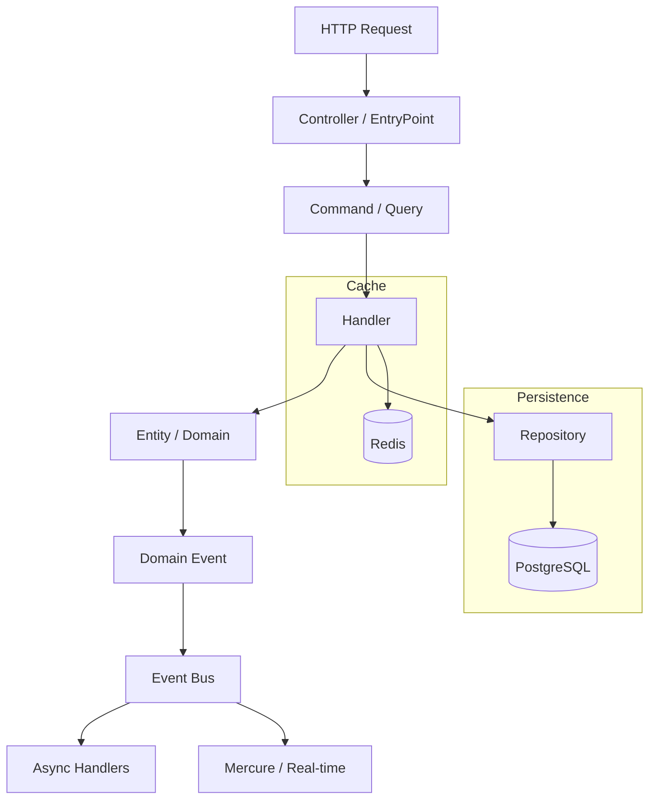

# 🧑‍💻 Pragmatic Franken

> **The PHP Cheat Code for 2026.**
> Build robust, high-performance Modular Monoliths while your AI Agent does the heavy lifting.

> **"Stop refactoring. Start delivering."**

[](https://www.php.net/releases/8.5/)
[](https://frankenphp.dev/)
[](https://symfony.com/)
[](https://opensource.org/licenses/MIT)
[](https://github.com/k2gl/pragmatic-franken/actions)
[](https://phpstan.org)
[](#)

---

## 🛸 Why Pragmatic Franken?

> **Stop refactoring. Start delivering.**

| Problem | Solution |
|---------|----------|
| Complex layered architecture | **Vertical Slices** — code grouped by business value |
| Nginx + FPM configuration hell | **FrankenPHP Worker Mode** — one binary, HTTP/3, 2ms latency |
| AI generates spaghetti code | **AI-Native structure** — agents understand context instantly |
| Code review debates | **Pint + PHPStan Level 9** — tools decide, humans review logic |
| Fear of deletion | **Rule of Deletion** — optimized for removal, not reuse |

---

## ⚡️ Zero Infrastructure Pain

| Feature | Traditional | Pragmatic Franken |
|---------|------------|-------------------|
| Web Server | Nginx + FPM | **FrankenPHP** (single binary) |
| Latency | ~50-100ms | **~2ms** (Kernel stays in memory) |
| HTTP Protocol | HTTP/1.1 | **HTTP/3** (built-in) |
| Configuration | 5 config files | **One Caddyfile** |

---

## 🦸 AI-First DX

This repo is **Agent-Native**. Cursor, Windsurf, and Copilot understand your architecture better than you do.

```bash
@AGENTS.md Implement a new 'Subscription' module following our architecture.
```

The AI Agent will:
1. **Analyze ADRs** — Reads architecture decisions for consistency
2. **Scaffold & Code** — Creates folders per Vertical Slice patterns
3. **Verify** — Runs `make check` to ensure nothing is broken
4. **Deliver** — Prepares a PR, ready for your review

---

## 🚀 Quick Start

```bash
# 1. Clone and ignite
git clone https://github.com/k2gl/pragmatic-franken.git && cd pragmatic-franken

# 2. The Magic Command
make install
```

**Boom!** Your app is live at https://localhost with automatic HTTPS.

---

## 🛠 Build Your First Feature

```bash
# Generate a complete feature slice
make slice module=User feature=Login
```

This creates:
```
src/User/Features/Login/
├── LoginAction.php      # HTTP entry point
├── LoginHandler.php     # Business logic
├── LoginDto.php         # Data contract
└── LoginHandlerTest.php # Feature test
```

---

## 📐 Architecture Decision Records

| ADR | Topic | Priority |
|-----|-------|----------|
| [0001](docs/adr/0001-vertical-slices.md) | Vertical Slices Architecture | P0 |
| [0002](docs/adr/0002-messenger-transport.md) | Messenger Transport (CQRS) | P0 |
| [0003](docs/adr/0003-pragmatic-symfony-architecture.md) | Pragmatic Symfony | P0 |
| [0008](docs/adr/0008-testing-strategy.md) | Testing Strategy (PHPUnit) | P1 |
| [0009](docs/adr/0009-shared-architecture.md) | Shared Architecture | P1 |

---

## 🛡 Bulletproof Quality

| Check | Tool | Command |
|-------|------|---------|
| Code Style | **Pint** | `make lint` |
| Static Analysis | **PHPStan Level 9** | `make analyze` |
| Tests | **PHPUnit** | `make test` |
| All Checks | **CI Pipeline** | `make check` |

> **Rule:** Do not push code that breaks CI.

---

## 📁 Project Structure

```
src/
├── Kernel.php              # Symfony MicroKernel
├── Shared/                 # Global infrastructure
│   ├── Infrastructure/    # Bus, Persistence, Logging
│   └── Domain/            # ValueObjects, Exceptions
├── User/                   # Module
│   ├── Entity/           # User.php
│   ├── Enum/             # UserRole.php
│   └── Features/          # Vertical Slices
│       └── Login/
│           ├── LoginAction.php
│           ├── LoginHandler.php
│           ├── LoginDto.php
│           └── LoginHandlerTest.php
└── ...
```

> **See [ADR-0001](docs/adr/0001-vertical-slices.md) for complete architecture rules.**

---

## 🎯 The Manifesto

> **"We optimize for Deletion, not for Reusability."**

Vertical Slices mean:
- **Features are isolated** — change one, break nothing else
- **Tests live with code** — delete folder = delete feature + tests
- **Duplication is OK** — 2 copies are cheaper than wrong abstraction

---

## 🚀 Roadmap 2026

| Quarter | Focus | What's Coming |
|---------|-------|---------------|
| **Q1** | Real-time & Connectivity | Mercure Hub, Event Sourcing Lite, TypeScript SDK Generator |
| **Q2** | AI & Agentic Autonomy | Self-Healing CI, Interactive Scaffolding, Context Injection |
| **Q3** | Edge & Performance | Static Binary Builds, Memory Management, SQLite + Litestream |
| **Q4** | Frontend & Ecosystem | HTMX/LiveWire Presets, Public Templates Marketplace |

[See full Roadmap →](docs/ROADMAP.md)

---

## 🛠 What to Do Next?

1. **Self-Check:** Run `make slice module=Demo feature=Success` — if files are created, your machine is ready.
2. **Push It:** Deploy to public repo and share.
3. **First Feature:** Try implementing real business logic (Telegram auth, Stripe integration) using `@AGENTS.md`. You'll be amazed how simple it became.

---

**"Stop refactoring. Start delivering."**

---

## ⚖️ Legacy vs Pragmatic

| Layer | Legacy | Pragmatic |
|-------|--------|-----------|
| Web Server | Nginx + FPM | **FrankenPHP** |
| Process Manager | Supervisord | **Worker Mode** |
| Scheduler | Crontab | **Symfony Scheduler** |
| Graceful Shutdown | Manual config | **Out of the box** |

**4 configs = 4 failure points. 1 Caddyfile = 1 source of truth.**

---

## 🍨 The Pragmatic Way

How we write code:

1. Create a Feature Slice
2. Define a Command or Query
3. Handle it

**No over-engineering.**

---

## 📊 Performance

FrankenPHP Worker Mode vs PHP-FPM benchmarks:

| Metric | PHP-FPM | FrankenPHP Worker | Source |
|--------|----------|-------------------|---------|
| Cold Boot | ~150ms | ~10ms | [FrankenPHP](https://frankenphp.dev/docs/benchmarks/) |
| Requests/sec | ~500 | ~8,000 | [TechEmpower](https://www.techempower.com/benchmarks/) |

*[Full benchmarks →](docs/PERFORMANCE.md)*

---

## 🐘 Worker Mode Rules

| Rule | Bad | Good |
|------|-----|------|
| No static cache | `static $cache = []` | `$this->cache->set()` |
| Stateless entities | Entity with static state | Pure entities |
| Clean shutdown | Implicit memory leaks | `register_shutdown_function()` |
| Avoid singletons | `Singleton::getInstance()` | Dependency Injection |

---

## 🔄 Deep Dive



**See [ADR 0002](docs/adr/0002-messenger-transport.md) for Message Bus implementation details.**

---

## 📁 Architecture: Vertical Slices & Modular Monolith 2.0
We don't do "folders by type" (all controllers in one place, all models in another). That's 2010. We group by Business Value.

```
src/
├── Kernel.php              # System core (Symfony MicroKernel)
├── Shared/                 # Global Shared (infrastructure only)
│   ├── Infrastructure/
│   │   ├── Bus/           # Messenger configuration
│   │   ├── Persistence/   # Doctrine extensions
│   │   └── Logging/       # Sentry, monitoring
│   └── Domain/
│       ├── ValueObject/    # Global value objects
│       └── Exception/      # Base exceptions
│
├── User/                   # Module (Bounded Context)
│   ├── Entity/            # User.php
│   ├── Enum/              # UserRole.php
│   ├── Service/           # PasswordHasher.php
│   ├── Events/            # UserRegisteredEvent.php
│   ├── Repositories/
│   └── Features/           # Vertical Slices (Business logic here 👇)
│       └── {FeatureName}/
│           ├── {FeatureName}Action.php     # Entry point (HTTP/CLI)
│           ├── {FeatureName}Handler.php    # Business logic
│           ├── {FeatureName}Dto.php        # Data transfer
│           └── {FeatureName}Test.php       # Local feature test
│
├── Task/                   # Module (same pattern)
├── Board/                  # Module (same pattern)
└── Health/                 # Technical feature (same pattern)
```

> **See [ADR-0009](docs/adr/0009-shared-architecture.md) for Shared architecture rules.**

Why this kicks ass:
1. **Locality of Change:** Want to change "User Registration"? Everything is in one folder. No jumping around 10 directories.
2. **Zero Side Effects:** Delete a folder — the entire feature is gone. No ghost code left behind.
3. **AI-Friendly:** Your AI Agent finds context instantly. It doesn't have to scan the whole src/Controllers folder to find one specific action.
4. **Low Cognitive Load:** You focus on the feature, not the framework.

### ⚡️ DX & Scaffolding
Stop wasting time on boilerplate. Use our generators to keep the architecture clean and consistent:

```bash
# Create a new Vertical Slice (Action + Handler + DTO + Test)
make slice module=Billing feature=Subscribe
```
---

## 📚 Guides

- [Development Guide](docs/guides/development.md)
- [Testing Guide](docs/guides/testing.md)
- [Worker Mode Guide](docs/guides/worker-mode.md)
- [AI Agent Setup](docs/guides/agent-setup.md)

---

## 🫵 Contributing

See [Contributing Guidelines](.github/CONTRIBUTING.md) for details.

---

**Build for 2026, not 2015. FrankenPHP is the engine, Symfony is the brain, AI is the hands.**
